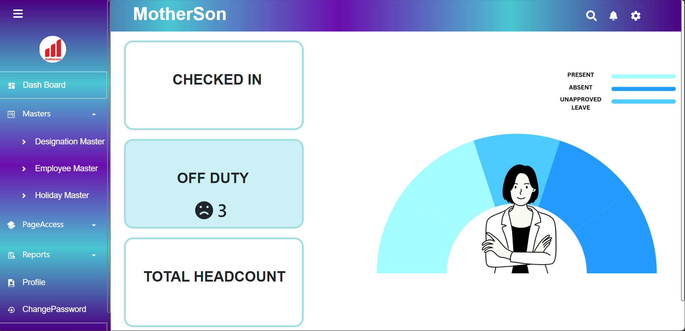
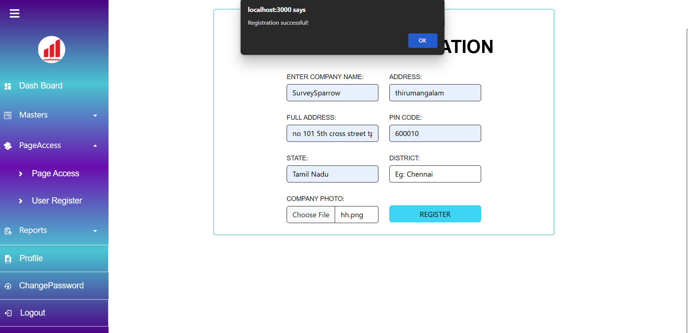
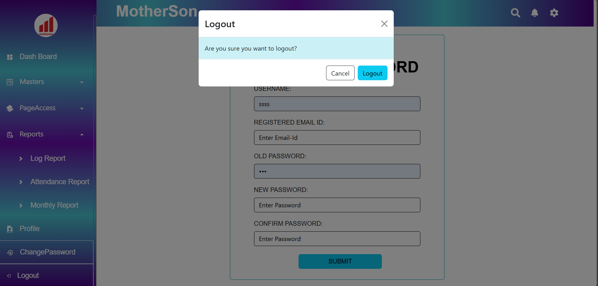
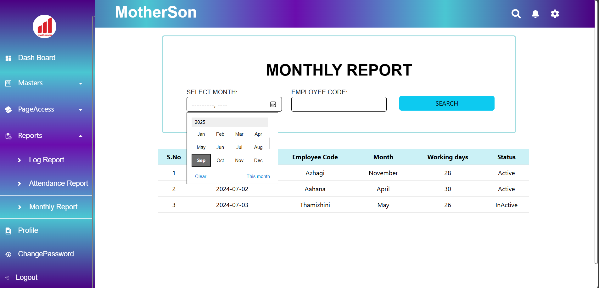

# Attendance Management System UI (Replica)

This project is a **React-based frontend** that replicates the UI of **Motherson’s Attendance Management System**.  
It includes an interactive dashboard, employee forms with validation, sidebar navigation, profile management, page access controls, and a logout confirmation modal.

---

## 🚀 Features
- 📊 Interactive Dashboard with employee headcount (present, absent, total).  
- 📝 Forms with validation for Designation, Employee, Holiday, and User registration.  
- 📂 Masters Module to manage designations, employees, and holidays.  
- 🔐 Page Access Control with role-based permissions.  
- 👤 Profile Management with pagination support.  
- 📑 Reports section (Log, Attendance, Monthly).  
- 📌 Sidebar Navigation with collapsible accordion menus.  
- ✅ Logout confirmation modal for safe exit.  

---

## 🛠️ Tech Stack
- React.js  
- React Router  
- Styled Components  
- Bootstrap / React-Bootstrap  
- React Icons  

---

## 📦 Installation & Setup

1. Clone the repository:
   ```bash
   git clone https://github.com/AkshayaS26/Attendance-Management-System.git
   cd Attendance-Management-System
2. Install dependencies:
   ```bash
   npm install
3. Start the development server:
   ```bash
   npm start
   Runs on http://localhost:3000

## 📸 Screenshots






## 🎯 Project Status

This project is created for educational purposes and demonstrates frontend UI only.
No backend or company-specific logic is included.